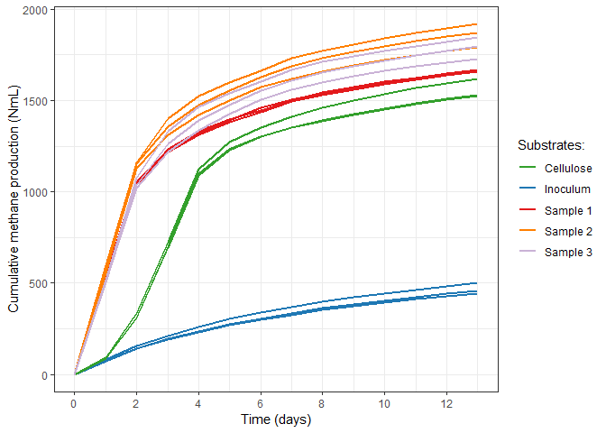
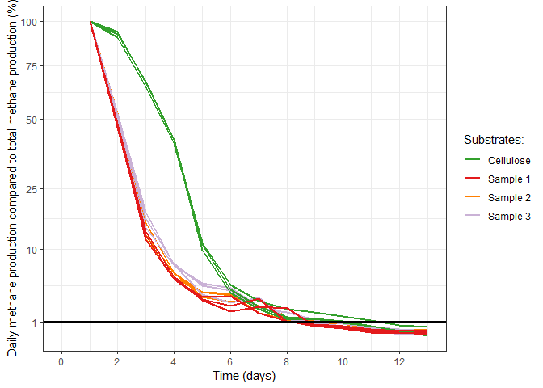
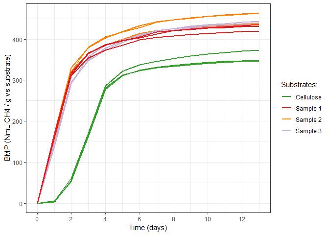
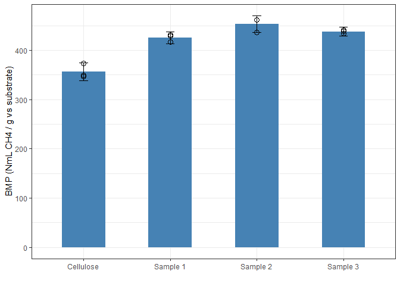
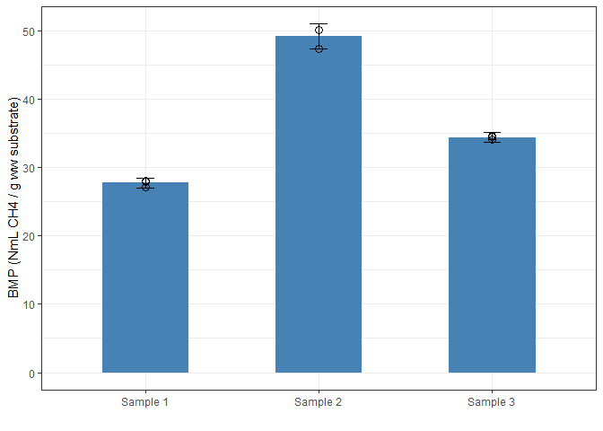

bmp-ampts2
================
Alexandre Bagnoud (alexandre.bagnoud@gmail.com),
version of 28 octobre 2019

This script automatically analyses daily reports generated by the AMPTS II system in order to measure the biomethane potential of substrate (BMP). The pipeline relies on the [biogas R package](https://cran.r-project.org/web/packages/biogas/index.html) from [Sasha D. Hafner](https://github.com/sashahafner) *et al*.

Providing a an AMPTS II daily report (as csv format) and another csv file that describes the BMP test setup, the script will automatically generate the following outputs:

1.  A [table](output_R_v1/day_13/1-cumulative_production_day13.csv) summarizing for each reactor and each day the gross methane production (in NmL CH<sub>4</sub>);
2.  A [plot](output_R_v1/day_13/2-cumulative_production_day13.png) showing the cumulated methane production for each reactor (in NmL CH<sub>4</sub>);
3.  A [plot](output_R_v1/day_13/3-daily_CH4_production_day13.png) showing for each reactor the methane production rate (i.e. the percentage of the daily CH<sub>4</sub> production over the total CH<sub>4</sub> production);
4.  A [plot](output_R_v1/day_13/4-bmp_curves_day13.png) showing for each reactor and for each day the BMP value (in NmL CH<sub>4</sub> g<sup>-1</sup> vs);
5.  A [table](output_R_v1/day_13/5-bmp_obs_and_rates_day13.csv) indicating for each reactor and for each day some useful test indicators (such as the CH<sub>4</sub> rate production, the relative standard deviation of the inoculum, and the CH<sub>4</sub> produced by the inoculum);
6.  A [table](output_R_v1/day_13/6-bmp_values_day13.csv) summarizing the BMP values for each substrate tested and for three termination criteria:
    -   end of the test (all date are used);
    -   after 25 days of test;
    -   when the daily CH<sub>4</sub> production rate stays below 1% of the total CH<sub>4</sub> production during three consecutive days;
7. A [barplot](output_R_v1/day_13/7-bmp_barplot_vs_day13.png) showing the BMP (expressed as NmL CH<sub>4</sub> g<sup>-1</sup> vs) for each sample tested;
8.  A [barplot](output_R_v1/day_13/8-bmp_barplot_ww_day13.png) showing the BMP (expressed as NmL CH<sub>4</sub> g<sup>-1</sup> ww) for each sample tested; 
9.  A [table](output_R_v1/day_13/9-bmp_summary_day13.csv) which reports the BMP values for each substrates, alongside with other useful (RSD of cellulose, RSD of substrates, fraction of CH<sub>4</sub> produced by the inoculum, etc.).

### 1) Input files

#### 1.1) AMPTS II daily report

Use here the daily report generated by AMPTS II. If not in csv format, you'll have to convert it by opening the xml file with Excel, and then by saving it as csv file.

Place all the report files into a subfolder named `log_files`.

#### 1.1) Setup file

The [setup file](setup_bmp.csv) `bmp_setup.csv` is a table that includes the following information (for each reactor):

-   `bottle.num`: the bottle number, which should correspond to the bottle number of the AMPTS II assay;
-   `bottle.id`: a unique identifier for each reactor;
-   `inoc.only`: 1 for inoculum-only reactors, 0 for the others;
-   `pos.control`: 1 for the positive control reactors (e.g. cellulose), 0 for the others;
-   `inoc.mass`: the mass of the inoculum used in each reactor (ww- or vs-based);
-   `substrate.mass.vs`: the mass of the substrate used in each reactor (VS-based only);
-   `sample.group`: a name for each group of sample replicates;
-   `plot.label`: the label that will be displayed on the plots for each group of sample replicates;
-   `plot.color`: the color (in hex format) that will be used for each reactors in the plots;
-   `dw`: the dry weight of each substrate used (in % \[g DW g<sup>-1</sup> ww\]);
-   `loi`: the loss on ignition of each substrate used (in % \[g loi g<sup>-1</sup> dw\]).

### 2) Setup the R environment

Set below your R variables:

-   `bmp.folder`: the folder that contains the `log_files/` folder and the setup file. The outputs will be generated here.
-   `log.folder`: the name of the folder containing the daily reports.
-   `setup.file`: the path to the setup file (relative to `bmp.folder`).
-   `output.folder`: the name of the folder in which outputs will be saved. This folder will be created in `bmp.folder`.
-   `inoculum`: a short description of the inoculum used for the BMP assay. It will be only used for generating the final report.
-   `start.time`: the starting date and time of the BMP assay (in `"%Y-%m-%d_%H%M"` format).

``` r
# Input files and output folder
bmp.folder <- "D:/eistore2_local/BMP/BMP_R_analysis/ampts2_scripts/github_repo/"
log.folder <- "log_files/"
setup.file <- "setup_bmp.csv"
output.folder <- "output_R_v1/"
inoculum <- "Anaerobic sludge from WWTP"
start.time <- "2019-10-07 11:30:00"

# Load R packages
library("biogas")
library("ggplot2")
library("RColorBrewer")
library("reshape2")

setwd(bmp.folder)
```

### 3) Import files

##### 3.1) Import the daily report

In case `log_files/` contains multiple daily reports, only the most recent one will be considered.

``` r
l <- list.files(path = log.folder, pattern = "report_.*day.*.csv")
log.file.day <- paste0(log.folder, l[length(l)])

daily.log <- read.table(log.file.day, header = T, as.is = T, skip = 16, fill = T, sep = ",")
```

##### 3.2) Test duration

``` r
# Starting date and time
s <- as.POSIXct(start.time, tz = "Europe/Berlin")

# End time
e <- sub(".*report_", "", log.file.day)
e <- sub(" day RS.txt", "", e)
e <- strptime(e, "%Y-%m-%d_%H%M", tz = "Europe/Berlin")

# Number of complete days
last.day <- as.numeric(floor(e-s))
```

Based on the test duration, all the uncomplete days in the daily report are dropped:

``` r
# Parse the log file
daily.log <- daily.log[daily.log$X0 <= last.day, c(1,17:31)]
colnames(daily.log) <- c("Days", 1:15)
```

##### 3.3) Import the test setup file

Here `xCH4` is the proportion of methane in the measured gas. As CO<sub>2</sub> is trapped in an alakine solution, the biogas produced is expected to contain only CH<sub>4</sub>, hence `xCH4` is set to `1`.

``` r
# Load setup data
setup.data <- read.table(setup.file, header = TRUE, sep = ",", nrows = 15, as.is = TRUE, comment.char = "@")
setup.data$channel <- row.names(setup.data)
setup.data$xCH4 <- 1
```

##### 3.4) Compute VS (volatile solid) mass and ISR (inoculum to substrate ratio) of substrate

The results of these calculation will be used later for the final report and for calculating BMP on a wet weight basis.

``` r
# Compute VS mass (on wet mass basis)
setup.data$vs.obs <- setup.data$dw * setup.data$loi / 100
setup.data$vs.mean <- NA

for (s in unique(setup.data$sample.group)) {
  setup.data$vs.mean[grepl(s, setup.data$sample.group)] <- mean(setup.data$vs.obs[grepl(s, setup.data$sample.group)])
}

# Compute ISR
setup.data$isr.obs <- setup.data$inoc.mass / setup.data$substrate.mass.vs
setup.data$isr.mean <- NA

for (s in unique(setup.data$sample.group)) {
  setup.data$isr.mean[grepl(s, setup.data$sample.group)] <- mean(setup.data$isr.obs[grepl(s, setup.data$sample.group)])
}
```

##### 3.5) Merge the daily report and the bmp setup dataframes

``` r
# Melt the dataframe
daily.log <- melt(daily.log, id.vars = 1)
colnames(daily.log) <- c("days", "channel", "CH4")

# Merge both dataframes
daily.log$bottle.id <- NA
daily.log$inoc.mass <- NA
daily.log$substrate.mass.vs <- NA
daily.log$xCH4 <- NA
daily.log$sample.group <- NA
daily.log$vs.mean <- NA
daily.log$isr.mean <- NA
daily.log$plot.label <- NA
daily.log$plot.color <- NA
daily.log$pos.control <- NA
daily.log$inoc.only <- NA
daily.log$pos.control <- NA

for (n in setup.data$bottle.num) {
  daily.log$bottle.id[n == daily.log$channel] <- setup.data$bottle.id[setup.data$bottle.num == n]
  daily.log$inoc.mass[n == daily.log$channel] <- setup.data$inoc.mass[setup.data$bottle.num == n]
  daily.log$substrate.mass.vs[n == daily.log$channel] <- setup.data$substrate.mass.vs[setup.data$bottle.num == n]
  daily.log$xCH4[n == daily.log$channel] <- setup.data$xCH4[setup.data$bottle.num == n]
  daily.log$sample.group[n == daily.log$channel] <- setup.data$sample.grou[setup.data$bottle.num == n]
  daily.log$vs.mean[n == daily.log$channel] <- setup.data$vs.mean[setup.data$bottle.num == n]
  daily.log$isr.mean[n == daily.log$channel] <- setup.data$isr.mean[setup.data$bottle.num == n]
  daily.log$plot.label[n == daily.log$channel] <- setup.data$plot.label[setup.data$bottle.num == n]
  daily.log$plot.color[n == daily.log$channel] <- setup.data$plot.color[setup.data$bottle.num == n]
  daily.log$pos.control[n == daily.log$channel] <- setup.data$pos.control[setup.data$bottle.num == n]
  daily.log$inoc.only[n == daily.log$channel] <- setup.data$inoc.only[setup.data$bottle.num == n]
  daily.log$pos.control[n == daily.log$channel] <- setup.data$pos.control[setup.data$bottle.num == n]
}
```

As the methane volume of the AMPTS II daily report are already normalized, we can set the temperature as `0` degrees Celsius and the pressure as `1013.25` hPa

``` r
daily.log$temp.celsius <- 0
daily.log$pressure.hPa <- 1013.25
```

### 3) Cumulative methane production

##### 3.1) Compute the cumulative CH<sub>4</sub> production

We can use here the `cumBg` function of the biogas package to do this calculation.

``` r
# Compute and plot cumulative methane production
cum.prod <- cumBg(dat=daily.log, dat.type = "vol", temp = "temp.celsius", pres = "pressure.hPa", data.struct = "longcombo",
                  id.name = "bottle.id", time.name = "days", dat.name = "CH4", comp.name = "xCH4",
                  unit.pres = "hPa", addt0 = TRUE, dry = TRUE)
```

    ## Working with volume data, applying volumetric method.

    ## Using a standard pressure of 1013.25 hPa and standard temperature of 0 C for standardizing volume.

Here we fill the NA gaps of the time zero lines

``` r
for (n in 1:nrow(cum.prod)) {
  if (is.na(cum.prod$channel[n])){
    cum.prod[n, 2:15] <- cum.prod[n+1, 2:15]
  }
}
```

##### 3.2) Export it as a csv file

``` r
# Create the output folder (if it does not exist)
if(!dir.exists(output.folder)) {dir.create(output.folder)}

dir.create(file.path(paste0(output.folder, "day_", last.day, "/")), showWarnings = FALSE)

# Save cum.prod as a csv file
output1 <- cum.prod[,-c(3,5:7, 9:17, 19, 21)]

write.table(output1, file = paste0(output.folder, "day_", last.day, "/1-cumulative_production_day",last.day, ".csv"), row.names = FALSE, quote = FALSE, sep = ",")

head(output1)
```

    ##   days channel   bottle.id sample.group  vCH4  cvCH4 rvCH4
    ## 1    0       4 cellulose 1    Cellulose   0.0    0.0    NA
    ## 2    1       4 cellulose 1    Cellulose  93.3   93.3  93.3
    ## 3    2       4 cellulose 1    Cellulose 239.2  332.5 239.2
    ## 4    3       4 cellulose 1    Cellulose 392.2  724.7 392.2
    ## 5    4       4 cellulose 1    Cellulose 398.3 1123.0 398.3
    ## 6    5       4 cellulose 1    Cellulose 150.7 1273.7 150.7

In this output :

-   `vCH4` is the volume of the produced CH<sub>4</sub > (in NmL) during the time interval (which is 1 day);
-   `cCH4` is the cumulated volume of the produced CH<sub>4</sub> (in NmL);
-   `rvCH4` is the production rate of CH<sub>4</sub> (in NmL day<sup>-1</sup>).

##### 3.2) Plot the cumulative production

``` r
plot <- ggplot(cum.prod, aes(x=days, y=cvCH4, group = channel, color = sample.group)) +
  geom_line(size = 1) +
  theme_bw() +
  ylab("Cumulative methane production (NmL)") +
  scale_x_continuous(name = "Time (days)", breaks = seq(0, max(cum.prod$days), by = 2)) +
  scale_colour_manual(values= unique(cum.prod$plot.color), name = "Substrates:", labels = unique(cum.prod$plot.label))

print(plot)
```



``` r
# Save the plot
png(filename = paste0(output.folder, "day_", last.day, "/2-cumulative_production_day", last.day, ".png"), units = "in", res = 300, width = 7, height = 5)
print(plot)
dev.off()
```

### 4) Rates of methane production

First, rates are calculated with `summBg` from the biogas package:

``` r
summBg.rates <- summBg(vol = cum.prod, setup = setup.data, id.name = "bottle.id", time.name = "days",
                       descrip.name = "sample.group",
                       inoc.name = unique(setup.data$sample.group[setup.data$inoc.only == 1]),
                       norm.name = "substrate.mass.vs",
                       inoc.m.name = "inoc.mass", show.obs = TRUE, show.rates = TRUE)
```

    ## Response variable (volume) is cum.prod$cvCH4.

Then, the rates are plotted. Be aware that the y-axis has a sqrt scale. The 1% threshold is highlighted with a thicker horizontal line.

``` r
rates.plot <- ggplot(summBg.rates, aes(x=days, y=rrvCH4, group = channel, color = sample.group)) +
  geom_line(size = 1) +
  theme_bw() +
  ylab("Daily methane production compared to total methane production (%)") +
  scale_x_continuous(name = "Time (days)", breaks = seq(0, max(cum.prod$days), by = 2)) +
  scale_y_sqrt(breaks = c(0, 1, 10, 25, 50, 75, 100, 125)) +
  scale_colour_manual(values = unique(summBg.rates$plot.color[summBg.rates$inoc.only == 0]), name = "Substrates:", labels = unique(summBg.rates$plot.label[summBg.rates$inoc.only == 0])) +
  geom_hline(yintercept=1, size = 1)

print(rates.plot)
```



The plot is saved

``` r
png(filename = paste0(output.folder, "day_", last.day, "/3-daily_CH4_production_day", last.day, ".png"), units = "in", res = 300, width = 7, height = 5)
print(rates.plot)
dev.off()
```

### 5) BMP curves

The plot that will be computed here will show us what would have been the BMP value (of each reactor) if we would have stop the test earlier.

First, we compute BMP values for each reactor and for each day with `summBg` function from the biogas package:

``` r
summBg.bmp.curves <- summBg(vol = cum.prod, setup = setup.data, id.name = "bottle.id", time.name = "days",
                            descrip.name = "sample.group",
                            inoc.name = unique(setup.data$sample.group[setup.data$inoc.only == 1]),
                            norm.name = "substrate.mass.vs",
                            inoc.m.name = "inoc.mass", show.obs = TRUE, when = "meas")
```

    ## Response variable (volume) is cum.prod$cvCH4.

    ## Inoculum contribution subtracted based on setup$inoc.mass.

    ## Response normalized by setup$substrate.mass.vs.

``` r
# Here we simply copy the methane rates production from 'summBg.rates'
summBg.bmp.curves$rrvCH4 <- summBg.rates$rrvCH4
```

BMP values can be plotted:

``` r
bmp.curves <- ggplot(summBg.bmp.curves, aes(x=days, y=cvCH4, group = channel, color = sample.group)) +
  geom_line(size = 1) +
  theme_bw() +
  ylab("BMP (NmL CH4 / g vs substrate)") +
  scale_x_continuous(name = "Time (days)", breaks = seq(0, max(cum.prod$days), by = 2)) +
  scale_colour_manual(values = unique(summBg.rates$plot.color[summBg.rates$inoc.only == 0]), name = "Substrates:", labels = unique(summBg.rates$plot.label[summBg.rates$inoc.only == 0]))

print(bmp.curves)
```



The plot is saved:

``` r
png(filename = paste0(output.folder, "day_", last.day, "/4-bmp_curves_day", last.day, ".png"), units = "in", res = 300, width = 7, height = 5)
print(bmp.curves)
dev.off()
```

`summBg.bmp.curves` is saved as a csv file:

``` r
output5 <- summBg.bmp.curves[,-c(3:6,8:17)]

write.table(output5, file = paste0(output.folder, "day_", last.day, "/5-bmp_obs_and_rates_day", last.day, ".csv"), row.names = FALSE, quote = FALSE, sep = ",")

head(output5)
```

    ##   days   bottle.id substrate.mass.vs isr.mean      cvCH4 vol.mi.mn
    ## 1    0 cellulose 1             3.071 3.233826   0.000000  0.000000
    ## 2    1 cellulose 1             3.071 3.233826   5.497507  7.642569
    ## 3    2 cellulose 1             3.071 3.233826  60.072174 14.803489
    ## 4    3 cellulose 1             3.071 3.233826 170.693639 20.052223
    ## 5    4 cellulose 1             3.071 3.233826 285.855052 24.516652
    ## 6    5 cellulose 1             3.071 3.233826 322.386436 28.368294
    ##   vol.mi.se n rsd.inoc cvCH4.tot cvCH4.inoc   fv.inoc   se.inoc cvCH4.se
    ## 1 0.0000000 3      NaN   0.00000    0.00000       NaN 0.0000000        0
    ## 2 0.2528687 3 5.730813  30.38098   24.88348 0.8190478 0.8233162        0
    ## 3 0.4824469 3 5.644767 108.27092   48.19875 0.4451680 1.5708009        0
    ## 4 0.7028500 3 6.071007 235.98176   65.28813 0.2766660 2.2884124        0
    ## 5 0.9380567 3 6.627177 365.67893   79.82388 0.2182895 3.0542231        0
    ## 6 1.1171079 3 6.820599 414.75090   92.36446 0.2226986 3.6371968        0
    ##   rrvCH4
    ## 1     NA
    ## 2 100.00
    ## 3  90.85
    ## 4  64.81
    ## 5  40.29
    ## 6  11.33

In this output, some columns intersting columns include:

-   `rsd.inoc`: relative standard deviation of the inoculum-only bottles (in %);
-   `fv.inoc`: fraction of methane in each bottle that comes from the inoculum;
-   `rrvCH4`: Daily methane production rate (in % of the total methane prodcution; what is plotted in `rates.plot`).

More information about these values can be found by typing `?summBg` in the console.

### 5) Calculation of the final BMP values (vs-based)

##### 5.1) BMP values according to 3 different termination criteria

First, we calculate the BMP values based on all data available:

``` r
bmp.end <- summBg(vol = cum.prod, setup = setup.data, id.name = "bottle.id", time.name = "days",
                  descrip.name = "sample.group",
                  inoc.name = unique(setup.data$sample.group[setup.data$inoc.only == 1]),
                  norm.name = "substrate.mass.vs",
                  inoc.m.name = "inoc.mass", when = "end", show.more = TRUE)
```

    ## Response variable (volume) is cum.prod$cvCH4.

    ## Inoculum contribution subtracted based on setup$inoc.mass.

    ## Response normalized by setup$substrate.mass.vs.

Then, we calculate the BMP values after 25 days. If the test did not last 25 days, we replaced all output values by `NA`:

``` r
if (last.day >= 25) {
  bmp.25d <- summBg(vol = cum.prod, setup = setup.data, id.name = "bottle.id", time.name = "days",
                    descrip.name = "sample.group",
                    inoc.name = unique(setup.data$sample.group[setup.data$inoc.only == 1]),
                    norm.name = "substrate.mass.vs",
                    inoc.m.name = "inoc.mass", when = 25, show.more = TRUE)
} else {
  bmp.25d <- bmp.end
  bmp.25d$days <- 25
  bmp.25d[,3:11] <- NA
}
```

Then, the BMP test of (all replicates of) a given substrate is terminated when the daily methane production drops below 1% of the total production for three consecutive days:

``` r
bmp.1p3d <- summBg(vol = cum.prod, setup = setup.data, id.name = "bottle.id", time.name = "days",
                   descrip.name = "sample.group",
                   inoc.name = unique(setup.data$sample.group[setup.data$inoc.only == 1]),
                   norm.name = "substrate.mass.vs",
                   inoc.m.name = "inoc.mass", when = "1p3d", show.more = TRUE)
```

    ## Response variable (volume) is cum.prod$cvCH4.

    ## Inoculum contribution subtracted based on setup$inoc.mass.

    ## Response normalized by setup$substrate.mass.vs.

    ## Warning in summBg(vol = cum.prod, setup = setup.data, id.name =
    ## "bottle.id", : You selected 1p3d option for "when" argument but there are
    ## no observations that meet the criterion for the following bottles. Instead,
    ## the latest time was selected. cellulose 1,

The chunk below is a bit tricky. It basically replace output value by `NA` in case the termination criterion is not achieved:

``` r
c.vector <- vector(mode = "character")
g.vector <- vector(mode = "character")
r1.vector <- vector(mode = "numeric")
r2.vector <- vector(mode = "numeric")
r3.vector <- vector(mode = "numeric")

for (c in unique(summBg.rates$channel)) {
  c.vector <- c(c.vector, c)
  group <- unique(summBg.rates$sample.group[summBg.rates$channel == c])
  g.vector <- c(g.vector, group)
  r1 <- summBg.rates$rrvCH4[summBg.rates$channel == c & summBg.rates$days == last.day-2]
  r1.vector <- c(r1.vector, r1)
  r2 <- summBg.rates$rrvCH4[summBg.rates$channel == c & summBg.rates$days == last.day-1]
  r2.vector <- c(r2.vector, r2)
  r3 <- summBg.rates$rrvCH4[summBg.rates$channel == c & summBg.rates$days == last.day]
  r3.vector <- c(r3.vector, r3)
}

if(length(r1.vector) == 0) {r1.vector <- rep(NA, length(unique(summBg.rates$channel)))}
if(length(r2.vector) == 0) {r2.vector <- rep(NA, length(unique(summBg.rates$channel)))}
if(length(r3.vector) == 0) {r3.vector <- rep(NA, length(unique(summBg.rates$channel)))}

rates.df <- data.frame(channel = c.vector, group = g.vector, r1 = r1.vector, r2 = r2.vector, r3 = r3.vector)

for (g in unique(bmp.1p3d$sample.group)){
  m <- max(rates.df[rates.df$group == g,3:5])
  if (m >= 1 | is.na(m)) {
    bmp.1p3d[bmp.1p3d$sample.group == g, 2:11] <- NA
  }
}
```

Finally, the 3 dataframes can be merged and saved as csv file:

``` r
bmp <- rbind(bmp.end, bmp.25d, bmp.1p3d)
bmp$term <- c(rep("end", nrow(bmp.end)), rep("25d", nrow(bmp.25d)), rep("1p3d", nrow(bmp.end)))


write.table(bmp, file = paste0(output.folder, "day_", last.day, "/6-bmp_values_day", last.day, ".csv"), row.names = FALSE, quote = FALSE, sep = ",")

bmp
```

    ##    sample.group days     mean        se        sd  n rsd.inoc   fv.inoc
    ## 1     Cellulose   13 356.5648 10.267664 17.784116  3 6.397894 0.3001387
    ## 2      Sample 1   13 429.3575  7.081338 12.265238  3 6.397894 0.2519656
    ## 3      Sample 2   13 455.3702  9.924730 17.190137  3 6.397894 0.2363577
    ## 4      Sample 3   13 439.8379  5.559033  9.628527  3 6.397894 0.2382067
    ## 5     Cellulose   25       NA        NA        NA NA       NA        NA
    ## 6      Sample 1   25       NA        NA        NA NA       NA        NA
    ## 7      Sample 2   25       NA        NA        NA NA       NA        NA
    ## 8      Sample 3   25       NA        NA        NA NA       NA        NA
    ## 9     Cellulose   NA       NA        NA        NA NA       NA        NA
    ## 10     Sample 1   11 425.3428  6.760054 11.708756  3 6.627789 0.2393978
    ## 11     Sample 2   12 453.0848  9.689786 16.783201  3 6.469474 0.2309978
    ## 12     Sample 3   12 437.7448  5.370338  9.301698  3 6.469474 0.2327726
    ##         se1      se2 se3 term
    ## 1  8.577060 5.644374   0  end
    ## 2  4.646466 5.343754   0  end
    ## 3  8.449819 5.205845   0  end
    ## 4  2.250100 5.083296   0  end
    ## 5        NA       NA  NA  25d
    ## 6        NA       NA  NA  25d
    ## 7        NA       NA  NA  25d
    ## 8        NA       NA  NA  25d
    ## 9        NA       NA  NA 1p3d
    ## 10 4.408944 5.124406   0 1p3d
    ## 11 8.249357 5.083311   0 1p3d
    ## 12 2.050059 4.963646   0 1p3d

More details about the values of this output can be found by typing `?summBg` in the console.

##### 5.2) Selection of a unique BMP value per substrate

In the last output, up to three BMP values were calculated according to 3 different termination criteria. Here only one will be kept, following this rationale:

1.  If the test lasted for more than 25 days and the production rate went below 1% before 25 days: the BMP test is stopped after 25 days;
2.  If the test lasted for more than 25 days and the production rate went below 1% after 25 days: the BMP test is stopped when the rates dropped below 1%;
3.  If the test did not last for 25 days and the production rate went below 1%: the BMP test is stopped when the rates dropped below 1%;
4.  If the test did not last for 25 days and the production rate did not go below 1%: all the production data are used to calculate the BMP values.

``` r
bmp.test.end <- as.data.frame(matrix(ncol = 12, nrow = 0))
colnames(bmp.test.end) <- colnames(bmp)

for (s in unique(bmp$sample.group)) {
  bmp.sample <- bmp[bmp$sample.group == s,]
  if (!is.na(bmp.sample$mean[3]) & !is.na(bmp.sample$mean[2])) {
    if (bmp.sample$days[3] < 25) {test.end <- 2}
    else {test.end <- 3}
  }
  else if (!is.na(bmp.sample$mean[3])) {test.end <- 3}
  else {test.end <- 1}
  bmp.test.end <- rbind(bmp.test.end, bmp.sample[test.end,])
}
```

Here we replace the labels `"25d"` by `"1p3d+25d"`, as they are all expected to have a production rate lower than 1%. We also replace the labels `"1p3d"` by `"1p3d+25d"` in case the BMP test lasted for more than 25 days:

``` r
bmp.test.end$term <- gsub("25d", "1p3d+25d",x = bmp.test.end$term)
for (r in 1:nrow(bmp.test.end)) {
  if (bmp.test.end$days[r] > 25) {
    bmp.test.end$term[r] <- gsub("1p3d", "1p3d+25d", x = bmp.test.end$term[r])
  }
}
```

##### 5.3) Barplots of the vs-based BMP

For each substrate, the BMP termination day according to `bmp.test.end` is read. Then, for this substrate and for this day, the BMP value of all replicates is extracted from `summBg.bmp.curves`:

``` r
bmp.obs.test.end <-  as.data.frame(matrix(ncol = 31, nrow = 0))
colnames(bmp.obs.test.end) <- colnames(summBg.bmp.curves)

for(s in bmp.test.end$sample.group) {
  for (t in bmp.test.end$days[bmp.test.end$sample.group == s]) {
    log <- summBg.bmp.curves$days == t & summBg.bmp.curves$sample.group == s
    bmp.obs.test.end <- rbind(bmp.obs.test.end, summBg.bmp.curves[log,])
  }
}
```

And here is the corresponding barplot, including the standard deviation (as error bars) and all individual measurments (as open circles):

``` r
barplot.vs <- ggplot(data=bmp.test.end, aes(x=sample.group, y=mean)) +
  geom_bar(stat="identity", width=0.5, fill="steelblue") +
  geom_errorbar(aes(ymin=mean-sd, ymax=mean+sd), width=.1) +
  geom_jitter(data=bmp.obs.test.end, aes(x=sample.group, y=cvCH4), width = 0, shape = 21, size = 3) +
  xlab("") +
  ylab("BMP (NmL CH4 / g vs substrate)") +
  theme(axis.text.x = element_text(angle = 45, hjust = 1)) +
  theme_bw() +
  scale_x_discrete(labels = unique(summBg.rates$plot.label))

print(barplot.vs)
```



Finally, the plot is saved:

``` r
png(filename = paste0(output.folder, "day_", last.day, "/7-bmp_barplot_vs_day", last.day, ".png"), units = "in", res = 300, width = 6, height = 4)
print(barplot.vs)
dev.off()
```

### 6) Calculation of the final BMP values (ww-based)

It can be useful to compute the BMP of substrate on a wet basis. We exclude the positive control from this calculation:

``` r
sample.list <- unique(setup.data$sample.group[setup.data$inoc.only + setup.data$pos.control == 0])
```

The final vs-based BMP values can be multiplied by the vs content (% g vs g<sup>-1</sup> ww) measured in substrates. This is done on the mean BMP values, and on the individual BMP values:

``` r
# mean ww-based BMP values
bmp.test.end.ww <- bmp.test.end[bmp.test.end$sample.group %in% sample.list , c(1,2,3,5,6,8,12)]
for (r in 1:nrow(bmp.test.end.ww)) {
  s <- bmp.test.end.ww$sample.group[r]
  vs.f <- unique(setup.data$vs.mean[setup.data$sample.group == s])
  bmp.test.end.ww$mean[r] <- bmp.test.end.ww$mean[r] * vs.f / 100
  bmp.test.end.ww$sd[r] <- bmp.test.end.ww$sd[r] * vs.f / 100
}

# Individual ww-based BMP values
bmp.obs.test.end.ww <- bmp.obs.test.end[bmp.obs.test.end$sample.group %in% sample.list,]
for (r in 1:nrow(bmp.obs.test.end.ww)) {
  s <- bmp.obs.test.end.ww$sample.group[r]
  vs.f <- unique(setup.data$vs.mean[setup.data$sample.group == s])
  bmp.obs.test.end.ww$cvCH4[r] <- bmp.obs.test.end.ww$cvCH4[r] * vs.f / 100
}
```

And here is the corresponding barplot, including the standard deviation (as error bars) and all individual measurments (as open circles):

``` r
barplot.ww <- ggplot(data=bmp.test.end.ww, aes(x=sample.group, y=mean)) +
  geom_bar(stat="identity", width=0.5, fill="steelblue") +
  geom_errorbar(aes(ymin=mean-sd, ymax=mean+sd), width=.1) +
  geom_jitter(data=bmp.obs.test.end.ww, aes(x=sample.group, y=cvCH4), width = 0, shape = 21, size = 3) +
  xlab("") +
  ylab("BMP (NmL CH4 / g ww substrate)") +
  theme(axis.text.x = element_text(angle = 45, hjust = 1)) +
  theme_bw() +
  scale_x_discrete(labels = unique(summBg.rates$plot.label[summBg.rates$pos.control==0]))

print(barplot.ww)
```



Finally, the plot is saved:

``` r
png(filename = paste0(output.folder, "day_", last.day, "/8-bmp_barplot_ww_day", last.day, ".png"), units = "in", res = 300, width = 5, height = 4)
print(barplot.ww)
dev.off()
```

### 7) BMP final report

Here, we will generate a report as table that will summarize the BMP assay.

First, we define a function that print from a vector of values its mean value plus/minus a 95% confidence interval:

``` r
print.mean.ic <- function(vec, quantile = 0.975, decimals = 1, suffix = "") {
  m <- mean(vec)
  sd <- sd(vec)
  n <- length(vec)
  error <- qt(quantile,df=n-1)*sd/sqrt(n)
  paste0(round(m, digits = decimals) , " ± ", round(error, digits = decimals), suffix)
}
```

The report will be generated as in a new dataframe `summary`:

``` r
summary <- as.data.frame(matrix(nrow = length(sample.list), ncol = 16))
colnames(summary) <- c("tag", "Substrate", "dw (g/g ww)", "vs (g/g dw)", "vs (g/g ww)", "BMP (NmL CH4/g vs)", "BMP (NmL CH4/g ww)",
                       "Replicates number", "ISR (g vs/g vs)", "BMP cellulose (NmL CH4/g vs)",
                       "RSD cellulose", "CH4 fraction from inoculum", "RSD BMP", "Test duration (days)", "Termination criterion", "Inoculum source")
```

The values that are identical for each tested substrate are filled in:

``` r
cpos.tag <- unique(setup.data$sample.group[setup.data$pos.control == 1])

summary$tag <- unique(setup.data$sample.group[setup.data$inoc.only == 0 & setup.data$pos.control == 0])
summary$`Inoculum source` <- inoculum
summary$`BMP cellulose (NmL CH4/g vs)` <- print.mean.ic(bmp.obs.test.end$cvCH4[bmp.obs.test.end$sample.group == cpos.tag])
summary$`RSD cellulose`<- paste0(round(bmp.test.end$sd[bmp.test.end$sample.group == cpos.tag] / bmp.test.end$mean[bmp.test.end$sample.group == cpos.tag] * 100,1), "%")
```

And then the other values are filled in, by picking them from other datframes:

``` r
sub.summary <- NULL
ms.summary <- NULL
vs.ms.summary <- NULL
vs.ww.summary <- NULL
bmp.vs.summary <- NULL
bmp.ww.summary <- NULL
n.summary <- NULL
duration.summary <- NULL
isr.summary <- NULL
f.inoc.summary <- NULL
rsd.summary <- NULL
end.criterion <- NULL

for (s in summary$tag) {
  sub.summary <- c(sub.summary, unique(setup.data$plot.label[setup.data$sample.group == s]))
  ms.summary <- c(ms.summary, print.mean.ic(setup.data$dw[setup.data$sample.group == s], suffix = "%"))
  vs.ms.summary <- c(vs.ms.summary, print.mean.ic(setup.data$loi[setup.data$sample.group == s], suffix = "%"))
  vs.ww.summary <- c(vs.ww.summary, print.mean.ic(setup.data$vs.obs[setup.data$sample.group == s], suffix = "%"))
  bmp.vs.summary <- c(bmp.vs.summary, print.mean.ic(bmp.obs.test.end$cvCH4[bmp.obs.test.end$sample.group == s]))
  bmp.ww.summary <- c(bmp.ww.summary, print.mean.ic(bmp.obs.test.end.ww$cvCH4[bmp.obs.test.end.ww$sample.group == s]))
  n.summary <- c(n.summary, sum(setup.data$sample.group == s))
  duration.summary <- c(duration.summary, bmp.test.end$days[bmp.test.end$sample.group == s])
  isr.summary <- c(isr.summary, round(unique(setup.data$isr.mean[setup.data$sample.group == s]),2))
  f.inoc.summary <- c(f.inoc.summary, paste0(round(bmp.test.end$fv.inoc[bmp.test.end$sample.group == s] * 100,1), "%"))
  rsd.summary <- c(rsd.summary, paste0(round(bmp.test.end$sd[bmp.test.end$sample.group == s] / bmp.test.end$mean[bmp.test.end$sample.group == s] * 100,1), "%"))
  end.criterion <- c(end.criterion, bmp.test.end$term[bmp.test.end$sample.group == s])
}

summary$Substrate <- sub.summary
summary$`dw (g/g ww)` <- ms.summary
summary$`vs (g/g dw)` <- vs.ms.summary
summary$`vs (g/g ww)` <- vs.ww.summary
summary$`BMP (NmL CH4/g vs)` <- bmp.vs.summary
summary$`BMP (NmL CH4/g ww)` <- bmp.ww.summary
summary$`Replicates number` <- n.summary
summary$`Test duration (days)` <- duration.summary
summary$`ISR (g vs/g vs)` <- isr.summary
summary$`CH4 fraction from inoculum` <- f.inoc.summary
summary$`RSD BMP` <- rsd.summary
summary$`Termination criterion` <- end.criterion
```

And here is the final polishing of the report dataframe, which is saved as csv file:

``` r
summary$`Termination criterion` <- gsub("1p3d+25d", "<1% 3d, >= 25 d", summary$`Termination criterion`)
summary$`Termination criterion` <- gsub("1p3d", "<1% 3d", summary$`Termination criterion`)
summary$`Termination criterion` <- gsub("end", "end of test", summary$`Termination criterion`)

print(summary)
```

    ##        tag Substrate dw (g/g ww) vs (g/g dw) vs (g/g ww)
    ## 1 Sample 1  Sample 1    8.7 ± 0%   74.9 ± 0%    6.5 ± 0%
    ## 2 Sample 2  Sample 2   11.6 ± 0%   93.5 ± 0%   10.8 ± 0%
    ## 3 Sample 3  Sample 3    8.4 ± 0%   93.5 ± 0%    7.9 ± 0%
    ##   BMP (NmL CH4/g vs) BMP (NmL CH4/g ww) Replicates number ISR (g vs/g vs)
    ## 1         425.3 ± 19         27.7 ± 1.2                 3            3.06
    ## 2       453.1 ± 35.5         49.1 ± 3.8                 3            2.98
    ## 3        437.7 ± 8.8         34.4 ± 0.7                 3            2.91
    ##   BMP cellulose (NmL CH4/g vs) RSD cellulose CH4 fraction from inoculum
    ## 1                 356.6 ± 36.9            5%                      23.9%
    ## 2                 356.6 ± 36.9            5%                      23.1%
    ## 3                 356.6 ± 36.9            5%                      23.3%
    ##   RSD BMP Test duration (days) Termination criterion
    ## 1    2.8%                   11                <1% 3d
    ## 2    3.7%                   12                <1% 3d
    ## 3    2.1%                   12                <1% 3d
    ##              Inoculum source
    ## 1 Anaerobic sludge from WWTP
    ## 2 Anaerobic sludge from WWTP
    ## 3 Anaerobic sludge from WWTP

``` r
write.table(summary, file = paste0(output.folder, "day_", last.day, "/9-bmp_summary_day", last.day, ".csv"), row.names = FALSE, quote = FALSE, sep = ",")
```
